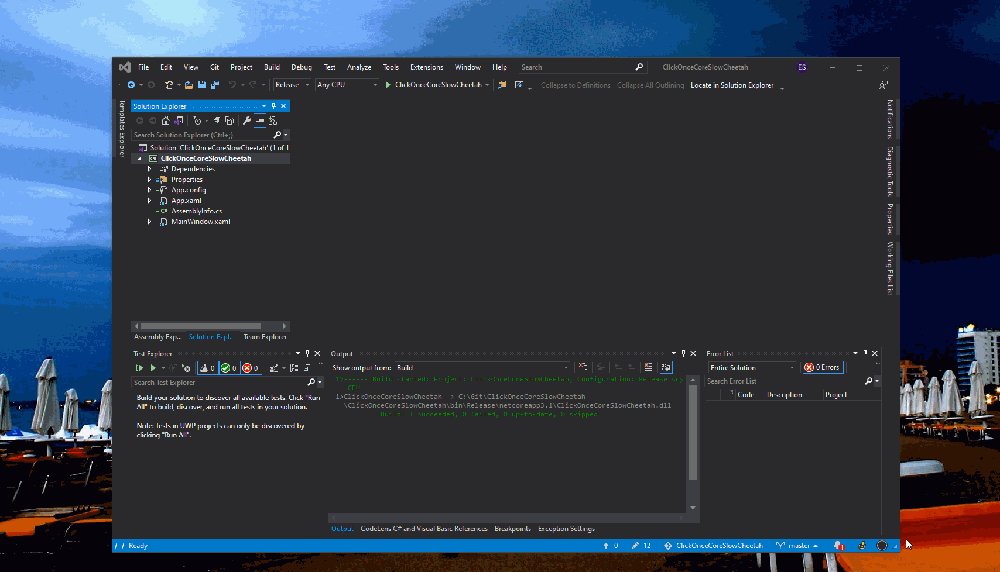

Demonstrates inability to push .net core 3.1 project that references
[Microsoft's Slow-Cheetah](https://github.com/microsoft/slow-cheetah) (3.2.18 as of the time of this writing) transform package for Visual Studio.

To reproduce:
- Download the repo and set for `Release` build in the Configuration selector.
- Build and run the app to confirm all dependencies are set.
- Right-click the `ClickOnceCoreSlowCheetah` project and hit **"Publish..."** to invoke ClickOnce.

This will **fail** to publish with an error about the build targets.

To fix:
- Double-click on `ClickOnceCoreSlowCheetah` to edit the xml and delete/comment out :
```xml
    <PackageReference Include="Microsoft.VisualStudio.SlowCheetah" Version="3.2.26">
      <PrivateAssets>all</PrivateAssets>
      <IncludeAssets>runtime; build; native; contentfiles; analyzers; buildtransitive</IncludeAssets>
    </PackageReference>
  </ItemGroup>
  ```
- Clean the solution.
- Right-click the `ClickOnceCoreSlowCheetah` project and hit **"Publish..."** again.

This time it should succeed. 

Everything in the project are defaults.  I simply created a new WPF (.NET Core 3.1) App which automatically created the window.  I did add a single `TextBlock` to it.  I then used the Publish Wizard, selected `Folder` for Target and `ClickOnce` for Specific Target, and used all defaults in subsequent screens.

<div style="text-align: center;">
    <a href="Documents/Screeny.gif" target="_blank">
        
    </a>  
</div>